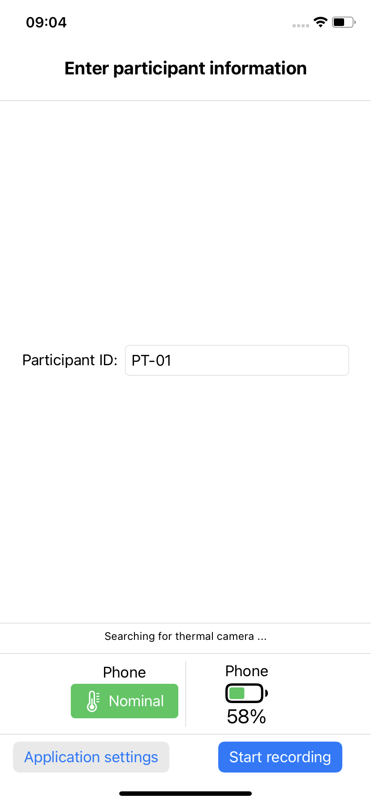
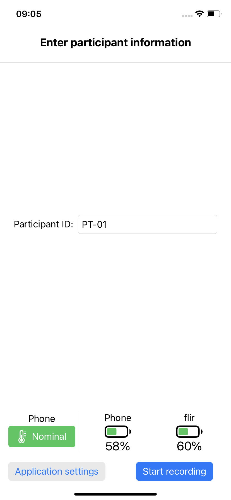
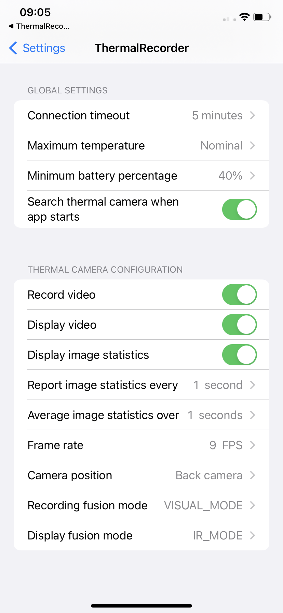
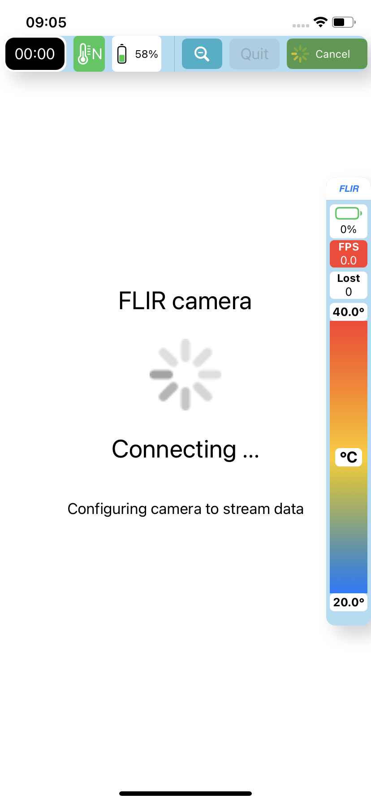
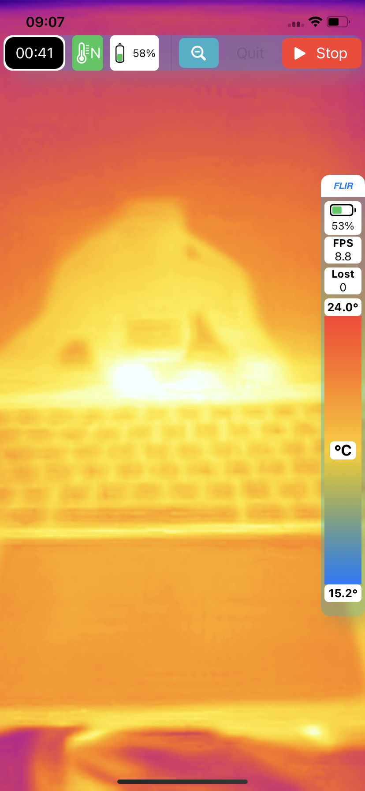
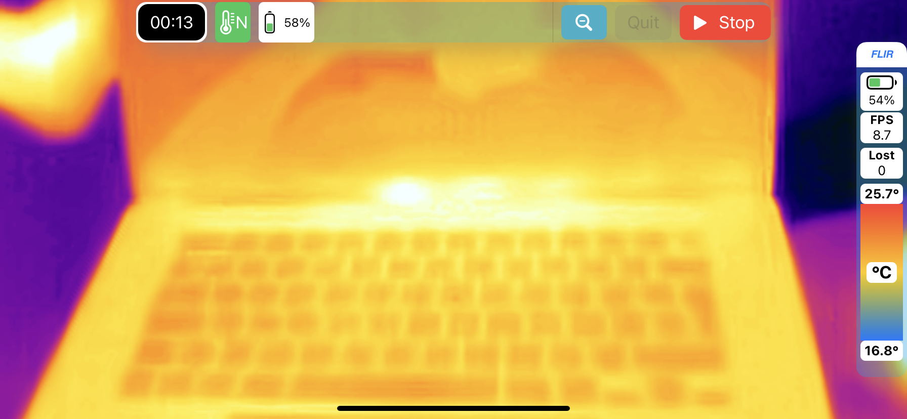

# ThermalRecorder

This application records video from thermal cameras such as the FLIR one Pro-series.

ThermalRecorder is free software: you can redistribute it or modify
it under the terms of the GNU General Public License as published by the
Free Software Foundation, version 2 only. Please check the file [COPYING](COPYING) for more information on the license and copyright.

If you use this app in your projects and publish the results, please cite the following manuscript:

> Villarroel, M. and Davidson, S., 2022. Open-source mobile platform for recording physiological data. arXiv preprint arXiv:1001.0001.
(TODO: Write the paper)

---

ThermalRecorder is an iOS application written in Swift. This repository only has the a minimum set of UI classes and configuraton settings (XCode files, Settings.bundle, etc) to launch the recording interface. The main functionality to connect, record and display data is provided by the following Swift Packages:

- [swift-sensor_recording_utils](https://github.com/maurovm/swift-sensor_recording_utils): A module containing shared utility methods and classes used by other modules and applications to record raw data from sensors. 
- [swift-thermal_camera](https://github.com/maurovm/swift-thermal_camera): The main module that has all the functionality to connect and record data from thermal cameras. 
- [swift-ios_thermal_sdk](https://github.com/maurovm/swift-ios_thermal_sdk): A Swift Package wrapping the multi-plaftform XCFrameworks for FLIR Mobile SDK.

Example of other applications making use of the above Swift Packages are:

- [swift-pulse_ox_recorder](https://github.com/maurovm/swift-pulse_ox_recorder): Application to record time-series data from devices that support Bluetooth Low Energy (BLE) protocol, such as heart rate monitors and pulse oximeters.
- [swift-waveform_plotter_example](https://github.com/maurovm/swift-waveform_plotter_example): Example application to plot time-series data.

## Supported devices

This application supports recording data from the following video cameras:

- FLIR ONE Pro LT Thermal Imaging Camera, -20 → +120 °C, 80 x 60 pixel Detector Resolution
- FLIR ONE Pro Thermal Imaging Camera, -20 → +400 °C, 160 x 120 pixel Detector Resolution

# Application

## Main entry form screen

When you launch the application, you are presented with the following screen:

    <kbd></kbd>

    <kbd></kbd>

The main entry screen also displays the current battery percentage and thermal state of the phone. Possible values for the thermal state follow the ones described by "[ProcessInfo.ThermalState](https://developer.apple.com/documentation/foundation/processinfo/thermalstate)" in Swift's Foundation framework:

- **Nominal**: The thermal state is within normal limits.
- **Fair**: The thermal state is slightly elevated.
- **Serious**: The thermal state is high.
- **Critical**: The thermal state is significantly impacting the performance of the system and the device needs to cool down.

You can configure the minim required levels before launching the main recording interface in the "application settings" screen.

## Applications settings

When you press the "Application settings" buttons in the main entry form screen, you are presented with the following screen:

    

    

    
Here, you can choose the main configuration settings for the entire application. As the application records data from devices using BLE, make sure you enable "Bluetooth" access for the application.

Global settings:

- **Connection timeout**: When recording is started, the application will attempt to connect to the BLE device for a maximum time period before stopping the session.
- **Maximum temperature**: If the phone's thermal state is higher than this value, you will need to wait for the phone to cool down before recording data. 
- **Minimum battery percentage**: If the phone's battery level is below this value, you will need to charge it before recording data.
- **Search thermal camera with app starts**: Select this if you want the application to connect to the thermal camera and display the battery level in the main entry form screen.

Thermal camera configuration
- **Record video**: If selected, the application will save the video data to individual files.
- **Display video**: If selected, the application will display video data on-screen.
- **Display image statistics**: Compute and display frame rate, min/max temperature and other image statistics.
- **Report image statistics every**: Update the display of image statistics at the requested time interval.
- **Average image statistics over**: Compute image statistics as average over a time interval.
- **Frame rate**: The rate to record video data. Note tha not all cameras support this setting.
- **Camera position**: This settings tries to mimic the position of the iOS native camera. Is the camera lens pointing to the Front (as a selfie camera), or to the back (as pointing away from you).
- **Recording fusion mode**: The FUSION mode used to record the video data to files (see FLIR documentation).
- **Display fusion mode**: The FUSION mode used to display video data on-screen (see FLIR documentation).

## Recording screen

When you are ready to record data. Select the "Start recording" button on the main screen. You will be presented with the main recording interface. You can now press on the "Start" button in green colour at the top right corner of the screen. The application will cycle through the stages of "Connecting...", "Starting..." and finally will display the values sent by the BLE peripheral. The following figures show some examples:

    

    <kbd></kbd>
    &nbsp; &nbsp; &nbsp;
    <kbd></kbd>

    <kbd></kbd>

> Note that the application supports both portrait and landscape orientation.

To stop the recording process, just press the "Stop" button in red colour. The application will finish and you will be sent back to the main entry form screen.

